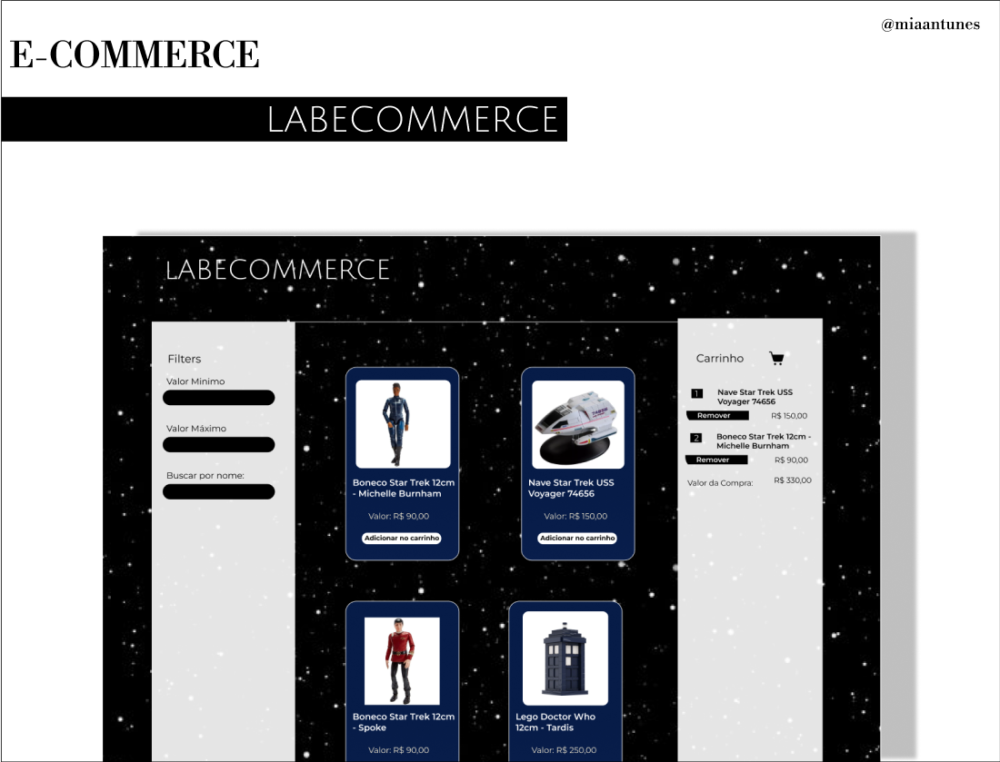

# E-commerce LABECOMMERCE

🛠 Em andamento 

Link para
[FIGMA](https://www.figma.com/file/J15c99k2zxzbbCG382EsP7/Labecomerce---Projeto?type=design&node-id=46%3A110&t=e1bQnjl6mEckqOWX-1)

 
 

# Sumário
<!--ts-->
   * [Sobre](#Sobre)
   * [Etapa de Construção](#etapa-de-construção)
   * [Tecnologias](#tecnologias)
   * [Hospedagem](#hospedagem)
   * [Licença](#licença)

<!--te-->
 
 

# Sobre

O principal objetivo do projeto de E-commerce é proporcionar uma imersão nos fundamentos do React.JS, bem como oferecer uma valiosa experiência de trabalho com essa biblioteca JavaScript. Nesse projeto, temos a oportunidade de adquirir conhecimentos sólidos sobre os conceitos essenciais do React.JS e aplicá-los de maneira prática na construção de um sistema de comércio eletrônico.
 
 

# Etapa de Construção
### Componentes de interface

-  Componente de Filtros
-  Componente Home (lista de produtos)
-  Componente de Carrinho
-  Componente de card de produto
-  Componente de quantidade de produto e ordenação

### Produtos

 - Criar o array de produtos e renderizar a lista de produtos com ele
 - Criar o arquivo com o array de produtos e exportar
 - Importar o array de produtos no componente base
 - Renderizar a lista de produtos com (Array.map)
 - Exibir a quantidade de produtos da lista
 - Pegar o length do array do produtos que estão sendo renderizados
 - Implementar a ordenação de produtos
 - Criar um novo estado com a lista de produtos com filtro
 - Implementar o onChange no input select e fazer a ordenação de acordo com o value do select (Array.sort)
 -Fazer a ordenação do valor min e valor máx, usando os dois ao mesmo tempo

### Carrinho

- Adicionar o produto na lista do carrinho
- Criar o estados para guardar a lista de itens do carrinho
- Implementar a função adicionar
- Implementar a função remover
- Salvar e  no LocalStorage 
- Recuperar os items quando atualiza com o LocalStorage
- Somar os valores

[Projects do Github - LABECOMMERCE](https://github.com/users/MiaAntunes/projects/6/views/2)
 
 
 

# Tecnologias

 
 
 

# Hospedagem
[Hospedagem](https://projectlabecommerce.vercel.app/)
 
 
 

# Licença

