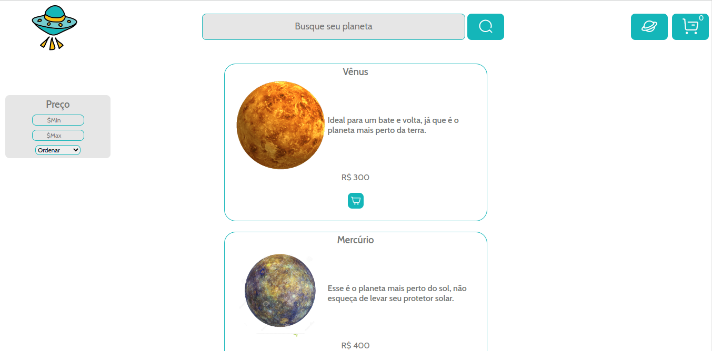

Ammal-Raissa-Baeta
<h1 align="center"> Viagens espaciais 🚀 </h1>

E-commerce de viagens espaciais

 Link do projeto:
https://viagemparamarte.surge.sh/

  <a href="#-tecnologias">Tecnologias</a>&nbsp;&nbsp;&nbsp;|&nbsp;&nbsp;&nbsp;
  <a href="#-projeto">Projeto</a>&nbsp;&nbsp;&nbsp;|&nbsp;&nbsp;&nbsp;
  <a href="#-layout">Layout</a>&nbsp;&nbsp;&nbsp;|&nbsp;&nbsp;&nbsp;
  <a href="#memo-licença">Licença</a>

 

  

## 🚀 Tecnologias

Esse projeto foi desenvolvido com as seguintes tecnologias:

- ReactJS
- JavaScript
- Styled Components
- Git e GitHub

## 💻 Projeto

Viagens espaciais é um e-commerce de viagens espaciais onde o usuário consegue adicionar os itens que quer comprar no carrinho e filtrar os itens por preço e ordem crescente e decrescente.

## 🔖 Layout

Você pode visualizar o layout do projeto através [DESSE LINK](https://www.figma.com/community/file/1023166487104363857) para acessá-lo.

## :memo: Licença

Esse projeto está sob a licença CC BY 04.

---

Feito com ♥ by Raissa.
