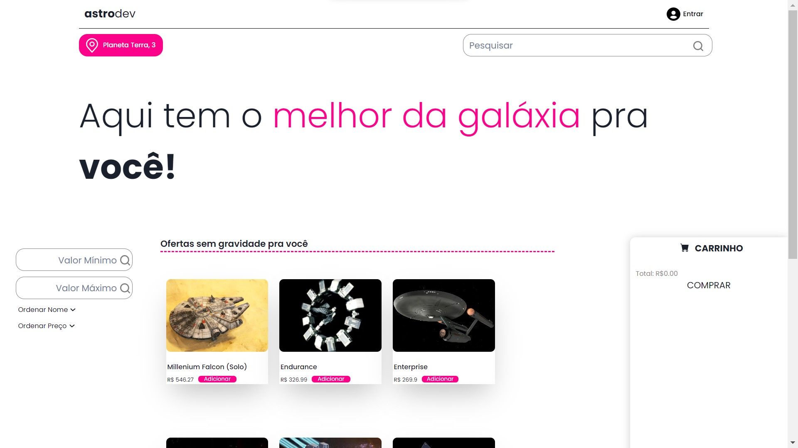

<h1 align="center">
  🧱 Projeto - Astrodev
</h1>

<h4 align="center"><a href="#">Clique para visitar o projeto</a></h4>

## 📚 Projeto

- **O Projeto:** Promovido pela instituição de ensino Full-Stack Labenu, o projeto incentiva a criação de um e-commerce simples com os fundamentos básicos de ReactJs

---

## 💻 Tecnologias utilizadas

Para o desenvolvimento deste site utilizei as seguintes tecnologias:

- HTML;
- ReactJs;
- JAVASCRIPT;
- ChackraUI;
- ANIMATE.CSS;
- Styled-Components

---

<table>