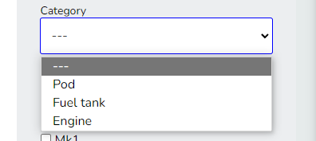
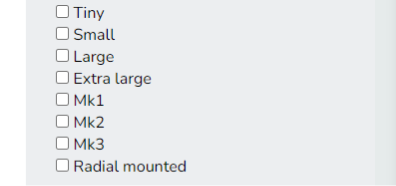
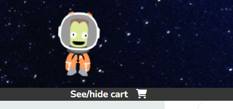
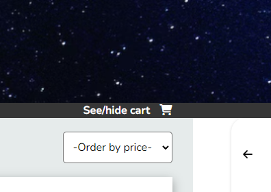

<a name="readme-top"></a>

<div align="center">
  <a href="https://github.com/othneildrew/Best-README-Template">
    
  </a>
  <h3 align="center">projeto-frontendreact</h3>
  <a href="https://jebs-garage.surge.sh/">https://jebs-garage.surge.sh/</a>
</div>

<!-- SOBRE O PROJETO -->
## Sobre o projeto

Este é o projeto de introdução aos fundamentos do React desenvolvido no bootcamp da Labenu - este repositório é o de entrega do projeto para avaliação da Labenu, o repositório original em que desenvolvi o projeto se encontra neste [link](https://github.com/vitorfontenele/shopping-cart).

O objetivo é que o projeto funcione como o front-end de um E-commerce, trabalhando conceitos de:

- JSX
- Componentes
- Props
- Estado
- Fluxo de dados no React
- Renderização de listas
- Renderização condicional
- localStorage

<p align="right">(<a href="#readme-top">voltar para o topo</a>)</p>

### Feito com


* [![React][React.js]][React-url]

<p align="right">(<a href="#readme-top">voltar para o topo</a>)</p>


<!-- INSTALAÇÃO -->
## Instalação

1. Clone o repositório:
   ```sh
   git clone https://github.com/vitorfontenele/projeto-frontendreact.git
   ```
2. Instale os pacotes NPM:
   ```sh
   npm install
   ```

<p align="right">(<a href="#readme-top">voltar para o topo</a>)</p>


## Requisitos

O projeto possui os seguintes requisitos:

- Home (Lista de Produtos)
    - [ ]  O usuário deve ser capaz de visualizar uma lista de produtos
    - [ ]  O usuário deve ser capaz de visualizar os dados do produto (nome, preço e imagem)
    - [ ]  O usuário deve ser capaz de adicionar um produto no carrinho
- Carrinho
    - [ ]  O usuário deve ser capaz de visualizar os produtos adicionados
    - [ ]  O usuário deve ser capaz de visualizar a quantidade correta de cada produto
    - [ ]  O usuário deve ser capaz de remover itens do carrinho
    - [ ]  O usuário deve ser capaz de ver corretamente o valor total de sua compra
    - [ ]  Quando a página é atualizada, os itens devem continuar no carrinho
- Filtros e Ordenação
    - [ ]  O usuário deve ser capaz de filtrar os itens por preço mínimo
    - [ ]  O usuário deve ser capaz de filtrar os itens por preço máximo
    - [ ]  O usuário deve ser capaz de realizar uma busca por nome
    - [ ]  O usuário deve ser capaz de ordenar os itens em ordem crescente ou decrescente
    - [ ]  O usuário deve ser capaz de adicionar  filtros, busca e ordenação simultaneamente
    - [ ]  O usuário deve ser capaz de retornar à visualização sem filtros
    
 ## Utilização
 
 Foram desenvolvidos todos os filtros pedidos nos requisitos: de preço mínimo, preço máximo, busca por nome e um filtro de ordenação por preço.
 
 Para além destes, foram adicionados dois filtros:
 
 - Filtro por categoria: cada produto tem uma categoria única, é possível filtrar por categoria através de um dropdown:
 
 
 
 - Filtro por tamanho radial: cada produto pode ter mais de um tamanho radial. É possível filtrar os produtos por tamanho radial através de caixas checkbox:
 
 
 
 Existem duas formas de acessar o carrinho (ou escondê-lo):
 
 - Clicando-se na opção "see/hide cart" no canto superior direito da página:

 
 
 - Clicando-se na seta presente no próprio carrinho:

 
 
 Uma vez acessado, o carrinho terá essa aparência:
  
 <!-- MARKDOWN LINKS & IMAGES -->
[React.js]: https://img.shields.io/badge/React-20232A?style=for-the-badge&logo=react&logoColor=61DAFB
[React-url]: https://reactjs.org/

