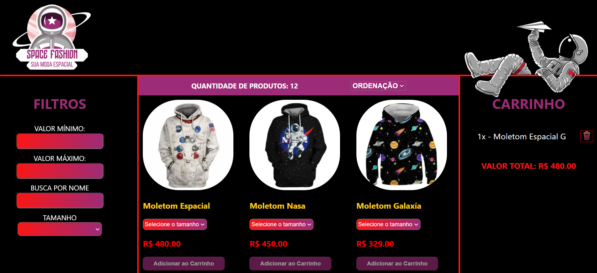
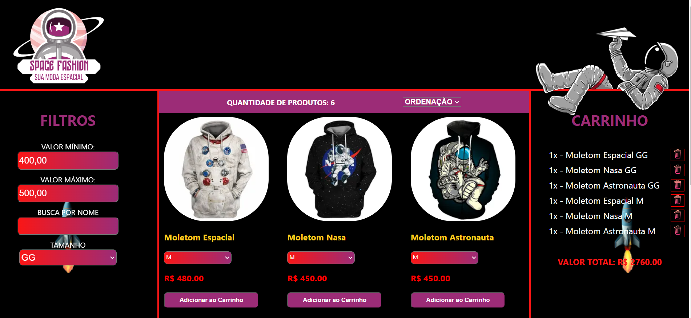
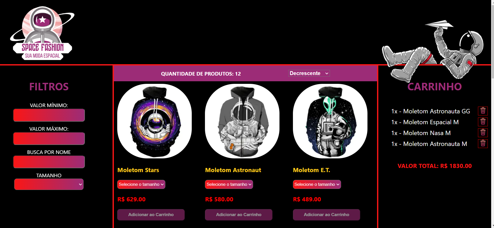
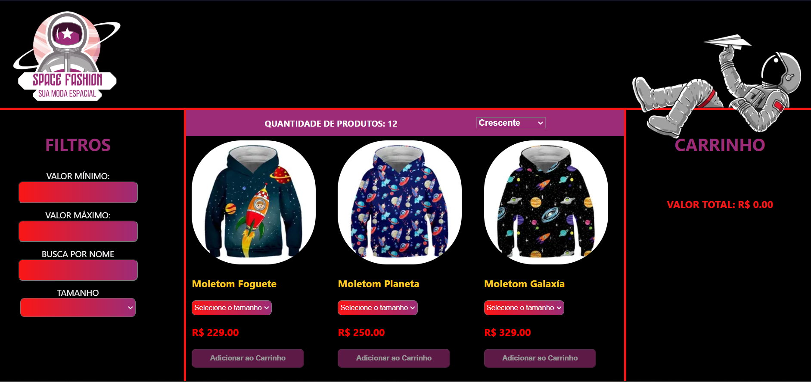
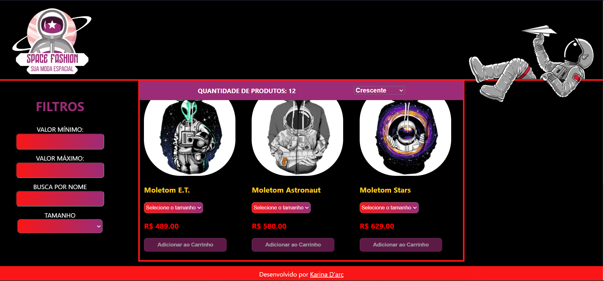
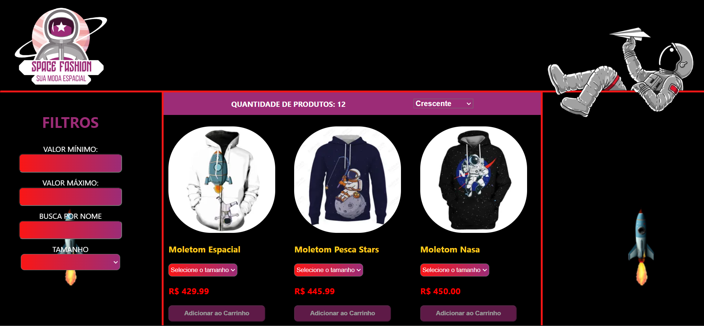
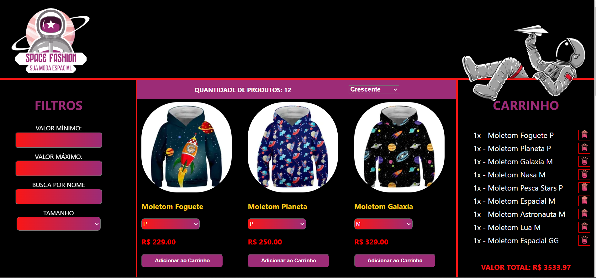

# Apresentação do Projeto-frontendreact

Este é um projeto introdutório aos fundamentos do React, onde serão apresentadas as principais ferramentas e a usabilidade de cada componente criado. O objetivo final do projeto é desenvolver um front-end para um E-Commerce.

# Tecnologias utilizadas

No projeto, serão abordadas os seguintes tecnologias:

- JSX: Extensão de sintaxe do JavaScript para escrever código semelhante a HTML no React.

- Componentes: Blocos de construção reutilizáveis para criar interfaces.

- Props: Mecanismo para passar dados de um componente pai para um componente filho.

- Estado: Conceito fundamental para representar informações mutáveis em um componente.

- Fluxo de dados no React: Direção unidirecional dos dados, das props do pai para os filhos.

- Renderização de listas: Renderização eficiente de elementos a partir de um array de dados.

- localStorage: API do navegador para armazenar dados de forma persistente.

- Styled-components: Biblioteca para escrever estilos CSS diretamente nos componentes React.

# Objetivos

O objetivo deste projeto é criar um E-Commerce chamado por mim de "Space Fashion", que consiste em uma loja online de moletons com estampas espaciais. A ideia é proporcionar aos usuários uma experiência semelhante à de um site de compras tradicional.

# Interface da Space Fashion
### Filtro
A página tem recursos de busca por valor mínimo, máximo, nome e, como um adicional, acrescentei filtro de buscar pro tamanho.

### Seção Principal
Na parte central, será exibidos os cards com a imagem dos produtos, contendo o nome, preço, tamanho disponível e botão de "Adicionar ao Carrinho". Os usuários poderão utilizar a barra de ordenação para buscar os produtos por ordem de preço, de forma crescente ou decrescente.

### Carrinho
A coluna lateral, conta com a seção do carrinho, onde os usuários poderão acompanhar em tempo real os itens sendo adicionados e o valor total sendo atualizado.

### Estilização
 O projeto conta com um design atraente e prático, facilitando a experiência do usuário ao navegar e simular sua compra. A barra horizontal exibirá o logotipo da loja "Space Fashion" e abaixo dela estarão as três colunas principais: Filtro, Seção Príncipal e Carrinho.

Com todas essas funcionalidades e um design bem elaborado, o projeto "Space Fashion" proporcionará uma experiência de compra completa e agradável aos usuários.


# Conferência da Lista de Requisitos

- Home (Lista de Produtos)
  - [x] O usuário deve ser capaz de visualizar uma lista de produtos
  - [x] O usuário deve ser capaz de visualizar os dados do produto (nome, preço e imagem)
  - [x] O usuário deve ser capaz de adicionar um produto no carrinho
- Carrinho
  - [x] O usuário deve ser capaz de visualizar os produtos adicionados
  - [x] O usuário deve ser capaz de visualizar a quantidade correta de cada produto
  - [x] O usuário deve ser capaz de remover itens do carrinho
  - [x] O usuário deve ser capaz de ver corretamente o valor total de sua compra
  - [x] Quando a página é atualizada, os itens devem continuar no carrinho
- Filtros e Ordenação
  - [x] O usuário deve ser capaz de filtrar os itens por preço mínimo
  - [x] O usuário deve ser capaz de filtrar os itens por preço máximo
  - [x] O usuário deve ser capaz de realizar uma busca por nome
  - [x] O usuário deve ser capaz de ordenar os itens em ordem crescente ou decrescente
  - [x] O usuário deve ser capaz de adicionar filtros, busca e ordenação simultaneamente
  - [x] O usuário deve ser capaz de retornar à visualização sem filtros

# Extra
Implementei um 4° filtro chamado "Tamanho" e adicionei funcionalidades de selecionar o tamanho antes de adicionar ao carrinho.

# Instalação

### Pré-requisitos:

-   Node.js
-   npm


Para instalar as dependências no diretório do seu projeto, execute o seguinte comando:

```sh
npm install
```

---

## Iniciando

Para iniciar o aplicativo, execute o seguinte comando:

```sh
npm run start
```

---

# Link do deploy:

[Github Pages](https://karinadarc.github.io/projeto-frontendreact/)










