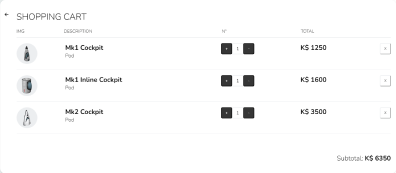

<a name="readme-top"></a>

<div align="center">
  <a href="https://github.com/othneildrew/Best-README-Template">
    
  </a>
  <h3 align="center">projeto-frontendreact</h3>
  <a href="https://jebs-garage.surge.sh/">https://jebs-garage.surge.sh/</a>
</div>

<!-- Conteúdo -->
<details>
  <summary>Conteúdo</summary>
  <ol>
    <li>
      <a href="#sobre-o-projeto">Sobre o projeto</a>
      <ul>
        <li><a href="#feito-com">Feito com</a></li>
      </ul>
    </li>
    <li>
      <a href="#instalação">Instalação</a>
    </li>
    <li><a href="#requisitos">Requisitos</a></li>
    <li>
      <a href="#utilização">Utilização</a></li>
      <ul>
        <li><a href="#filtros">Filtros</a></li>
        <li><a href="#carrinho">Carrinho</a></li>
      </ul>
    <li><a href="#licença">Licença</a></li>
    <li><a href="#contato">Contato</a></li>
    <li><a href="#contribuições">Contribuições</a></li>
  </ol>
</details>

<!-- SOBRE O PROJETO -->
## Sobre o projeto

Este é o projeto de introdução aos fundamentos do React desenvolvido no bootcamp da Labenu - este repositório é o de entrega do projeto para avaliação da Labenu, o repositório original em que desenvolvi o projeto se encontra neste [link](https://github.com/vitorfontenele/shopping-cart).

O objetivo é que o projeto funcione como o front-end de um E-commerce, trabalhando conceitos de:

- JSX
- Componentes
- Props
- Estado
- Fluxo de dados no React
- Renderização de listas
- Renderização condicional
- localStorage

A temática escolhida para o projeto foi relacionada ao jogo [Kerbal Space Program](https://pt.wikipedia.org/wiki/Kerbal_Space_Program).

<p align="right">(<a href="#readme-top">voltar para o topo</a>)</p>

### Feito com


* [![React][React.js]][React-url]

<p align="right">(<a href="#readme-top">voltar para o topo</a>)</p>


<!-- INSTALAÇÃO -->
## Instalação

1. Clone o repositório:
   ```sh
   git clone https://github.com/vitorfontenele/projeto-frontendreact.git
   ```
2. Instale os pacotes NPM:
   ```sh
   npm install
   ```

<p align="right">(<a href="#readme-top">voltar para o topo</a>)</p>


<!-- REQUISITOS -->
## Requisitos

O projeto possui os seguintes requisitos:

- Home (Lista de Produtos)
    - [ ]  O usuário deve ser capaz de visualizar uma lista de produtos
    - [ ]  O usuário deve ser capaz de visualizar os dados do produto (nome, preço e imagem)
    - [ ]  O usuário deve ser capaz de adicionar um produto no carrinho
- Carrinho
    - [ ]  O usuário deve ser capaz de visualizar os produtos adicionados
    - [ ]  O usuário deve ser capaz de visualizar a quantidade correta de cada produto
    - [ ]  O usuário deve ser capaz de remover itens do carrinho
    - [ ]  O usuário deve ser capaz de ver corretamente o valor total de sua compra
    - [ ]  Quando a página é atualizada, os itens devem continuar no carrinho
- Filtros e Ordenação
    - [ ]  O usuário deve ser capaz de filtrar os itens por preço mínimo
    - [ ]  O usuário deve ser capaz de filtrar os itens por preço máximo
    - [ ]  O usuário deve ser capaz de realizar uma busca por nome
    - [ ]  O usuário deve ser capaz de ordenar os itens em ordem crescente ou decrescente
    - [ ]  O usuário deve ser capaz de adicionar  filtros, busca e ordenação simultaneamente
    - [ ]  O usuário deve ser capaz de retornar à visualização sem filtros
    
<p align="right">(<a href="#readme-top">voltar para o topo</a>)</p>

 <!-- UTILIZAÇÃO -->   
 ## Utilização
 
 ### Filtros
 
 Foram desenvolvidos todos os filtros pedidos nos requisitos: de preço mínimo, preço máximo, busca por nome e um filtro de ordenação por preço.
 
 Para além destes, foram adicionados dois filtros:
 
 - Filtro por categoria: cada produto tem uma categoria única, é possível filtrar por categoria através de um dropdown:
 
 
 
 - Filtro por tamanho radial: cada produto pode ter mais de um tamanho radial. É possível filtrar os produtos por tamanho radial através de caixas checkbox:
 
 
 
 ### Carrinho
 
 Existem duas formas de acessar o carrinho (ou escondê-lo):
 
 - Clicando-se na opção "see/hide cart" no canto superior direito da página:

 
 
 - Clicando-se na seta presente no próprio carrinho:

 
 
 Uma vez acessado, o carrinho terá a seguinte aparência:
 
 
 
 <p align="right">(<a href="#readme-top">voltar para o topo</a>)</p>
 
<!-- LICENSE -->
## Licença

Distribuído sob a MIT License. Veja `LICENSE.txt` para mais informações.

<p align="right">(<a href="#readme-top">voltar para o topo</a>)</p>
 
 <!-- CONTATO -->
 ## Contato

[![Github][github-shield]][github-url][![Linkedin][linkedin-shield]][linkedin-url]

Link do Projeto: [https://github.com/vitorfontenele/projeto-frontendreact](https://github.com/vitorfontenele/projeto-frontendreact)

<p align="right">(<a href="#readme-top">voltar para o topo</a>)</p>
 
  <!-- CONTRIBUIÇÕES -->
 ## Contribuições

* [Vite](https://vitejs.dev)
* [Surge](https://surge.sh/)
* [Kerbal Space Program Wiki](https://wiki.kerbalspaceprogram.com/wiki/Parts)
* [HTML Table to JSON Converter](https://www.convertjson.com/html-table-to-json.htm)
* [Font Awesome](https://fontawesome.com)
* [SVG Repo](svgrepo.com)
* [Unsplash](unsplash.com)
* [Tutorial de React – Como trabalhar com várias caixas de seleção](https://www.freecodecamp.org/portuguese/news/tutorial-de-react-como-trabalhar-com-varias-caixas-de-selecao/)

<p align="right">(<a href="#readme-top">voltar para o topo</a>)</p>
  
 <!-- MARKDOWN LINKS & IMAGES -->
[React.js]: https://img.shields.io/badge/React-20232A?style=for-the-badge&logo=react&logoColor=61DAFB
[React-url]: https://reactjs.org/
[linkedin-shield]: https://img.shields.io/badge/LinkedIn-0077B5?style=for-the-badge&logo=linkedin&logoColor=white
[linkedin-url]: https://www.linkedin.com/in/vitor-fontenele/
[github-shield]: https://img.shields.io/badge/GitHub-100000?style=for-the-badge&logo=github&logoColor=white
[github-url]: https://github.com/vitorfontenele

